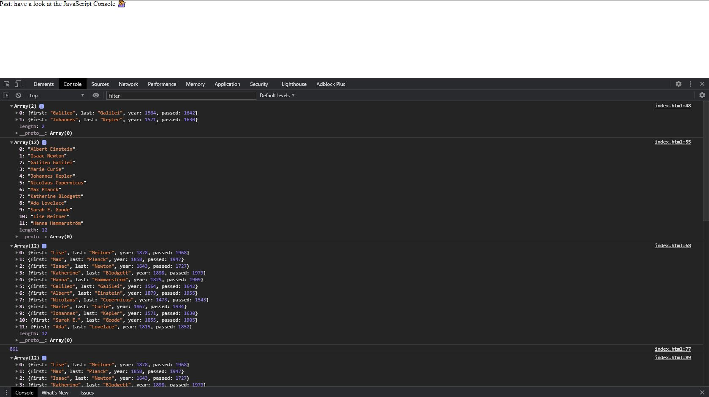

# ArrayCardio

This is day 4 of Wes Bos' JavaScript30 code along program, you can find the video <a href src="https://www.youtube.com/watch?v=HB1ZC7czKRs&list=PLu8EoSxDXHP6CGK4YVJhL_VWetA865GOH&index=4">here.</a>
In this lesson we worked with arrays using the sort, map, and reduce methods as well as the compare function and some E6 JS.

